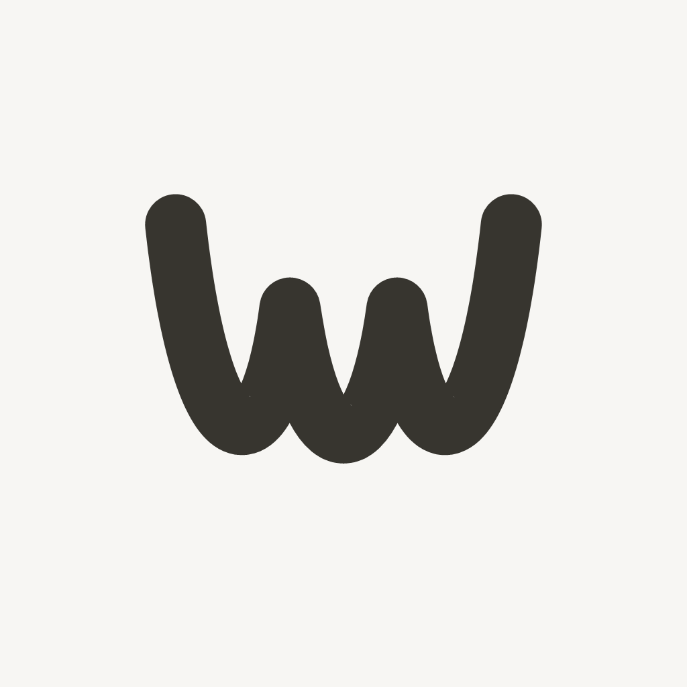

<p align="center">
  
</p>

<h1 align="center">Wyrm for iOS</h1>

<p align="center">
  The native iPhone client in the Wyrm ecosystem.<br>
  SwiftUI product surfaces over the original C game engine.
</p>

## Project status

Wyrm for iOS is under active development. The current source version is
**0.9.0 (build 30)** and targets **iOS 15 or newer**.

The repository contains the iOS application source and its automated Apple
build pipeline. It does not publish GitHub Releases; each accepted build is
compiled and tested by CI, then exposed as a workflow artifact.

## Current capabilities

- SwiftUI launch, username/password account access and animated onboarding.
- Play, Alerts, Social, Skin and Settings product surfaces.
- Original Wyrm C gameplay and network engine—not a Swift reimplementation.
- SDL3 window/input integration and Vulkan rendering through MoltenVK/Metal.
- Original landscape lobby and arena inside a portrait-owned iOS application.
- Live backend integration for profiles, notifications, leaderboards, people,
  direct conversations and voice-room control operations.
- Native engine settings and on-screen controls connected through a narrow,
  thread-safe Swift/C bridge.
- Opt-in Developer Mode with bounded local logs and native iOS Share Sheet
  export for support diagnostics.

## Architecture

```text
SwiftUI product shell
        │
bounded Swift/C bridge
        │
original Wyrm C engine
        │
SDL3 · Vulkan · MoltenVK · Metal
```

UIKit owns the stable app container. Product screens remain portrait. When the
player enters the lobby or arena, only the native engine child surface is
rotated, so gameplay keeps its original landscape layout without changing the
application's iOS orientation contract.

## Building

Apple compilation runs on macOS through the repository's
`Compile original Android engine for Apple` workflow. The project is generated
from `original-engine.yml`; pinned SDL3 and MoltenVK packages are fetched and
verified during the job.

Successful build artifacts include:

- `Wyrm-0.9.0-build-30-unsigned.ipa` for user-side signing and installation.
- `Wyrm-0.9.0-build-30-simulator.app.zip` for Simulator/Appetize testing.
- SHA-256 checksums, simulator screenshots and runtime smoke-test logs.

The IPA is intentionally unsigned. App Store, TestFlight and distribution
signing material is never stored in this repository.

## Repository guide

| Path | Purpose |
|---|---|
| `SourcesShell/` | SwiftUI interface, account/services clients and diagnostics |
| `SourcesOriginal/` | UIKit container and Apple-specific native adapters |
| `SharedEngine/` | Verified native-engine source snapshot used by Apple builds |
| `Resources/` | App icon, fonts and packaged engine resources |
| `Scripts/` | Dependency verification and reproducible source preparation |
| `original-engine.yml` | XcodeGen project specification |
| `.github/workflows/` | Apple compile, package and simulator verification pipeline |

## Security and privacy

- Do not commit credentials, signing certificates, provisioning profiles,
  access tokens, private player data or local diagnostic exports.
- Authentication secrets are stored by the app in iOS Keychain.
- Developer diagnostics are local, expire after seven days, are size-bounded,
  and intentionally omit tokens, passwords and private message bodies.
- Android sources remain the read-only behavior reference for this iOS port.

## Current limitations

Physical-device acceptance, live skin application, realtime voice audio, APNs,
avatar upload and Files-based backup/restore remain in development. CI success
proves Apple compilation and Simulator behavior; it is not a physical-device or
App Store acceptance claim.
